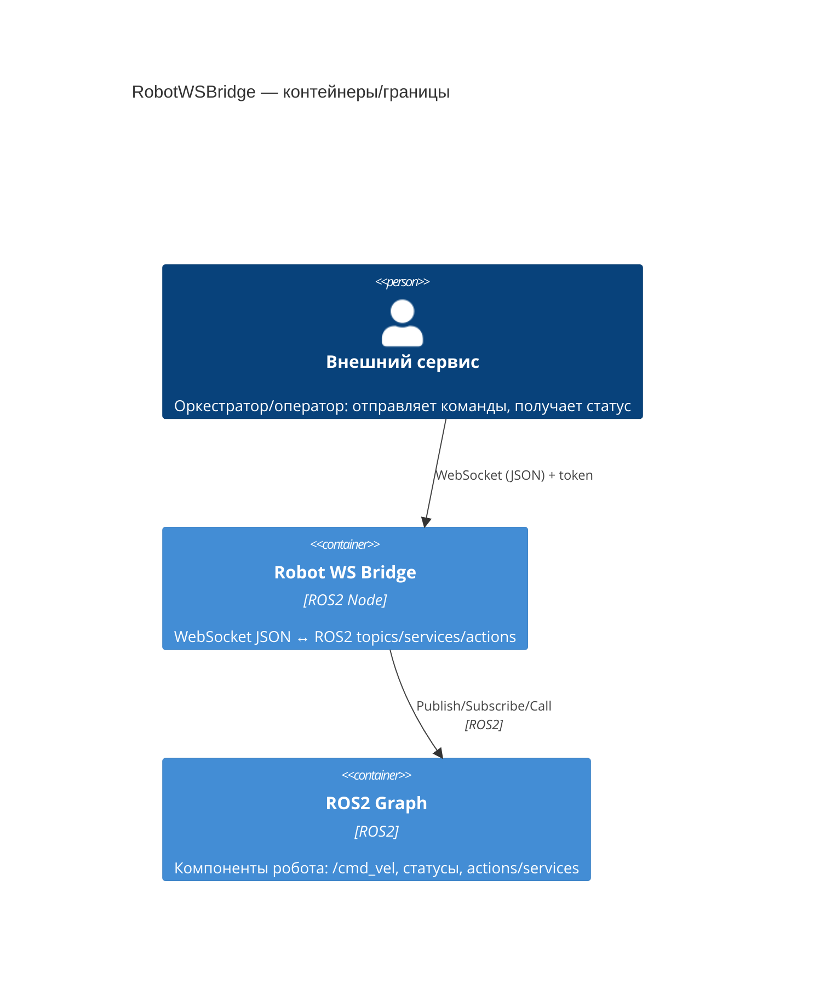
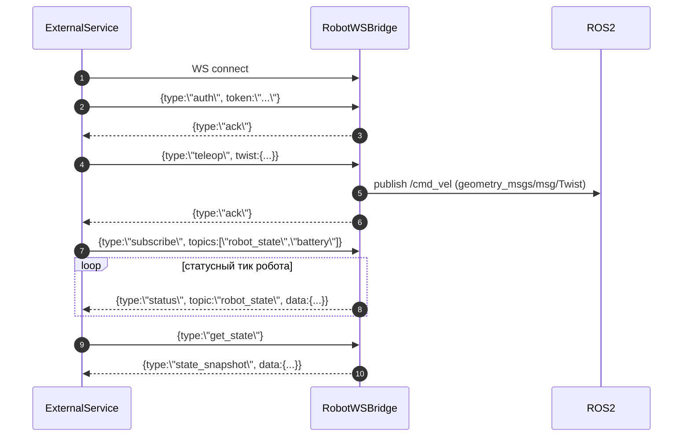

### ADR-0001: WS сервер на роботе как ROS2 node (bridge JSON ↔ ROS2)

### Статус

accepted

### Контекст

Нужно обеспечить управление роботом и получение его состояния из внешнего сервиса по WebSocket:

- **Команды** приходят в виде JSON по WS и должны быть транслированы в ROS2 (topics/services/actions).
- Нужен **обратный канал**: робот отправляет статусы (батарея и т.д.) во внешний сервис.
- Во внешнем сервисе уже есть “тик” (периодическая логика), который удобен для отправки teleop команд.
- Требуется простая **аутентификация токеном**, передаваемым через **настройки окружения** на роботе.

Требования к MVP, которые уже зафиксированы в обсуждении:

- Команда движения должна соответствовать публикации:
  - `ros2 topic pub /cmd_vel geometry_msgs/msg/Twist "{linear: {x: 0.57, y: 0.0, z: 0.0}, angular: {x: 0.0, y: 0.0, z: 0.0}}"`
- Статусы (battery и т.п.) **пока мокируются** для демонстрации робототехнику; должна быть явная точка модификации для подключения реальных ROS2 топиков/типов.

### Решение

Реализовать **WS сервер “на роботе” как ROS2 node** (внутри ROS2 workspace), который:

- Поднимает WebSocket сервер.
- Принимает JSON сообщения с явным полем `type` и версией протокола `v1` (версионирование логическое, не обязательно в URL).
- После успешной авторизации публикует команды в ROS2 (MVP: `teleop` → publish `geometry_msgs/msg/Twist` в `/cmd_vel`).
- Для статусов поддерживает **push** (периодический тик на роботе и/или “по событию”) + **pull** “снимок состояния по запросу” для синхронизации при переподключении.

#### Принятые поведенческие правила

- **Тик команд**: у **оркестратора/клиента** (он отправляет `teleop` на своём тике).
- **Тик статусов**: у **робота** (он пушит статусы подписчикам), плюс команда “дай состояние сейчас” (snapshot).
- **Backpressure**: WS отправка статусов не должна блокировать ROS2 callbacks; при переполнении очередей применяем политику (дроп/сэмплинг/разрыв соединения).
- **Auth token**: обязательный, задаётся через env (например, `WS_AUTH_TOKEN`), и требуется до обработки команд.

#### Диаграмма (обязательно)

### Альтернативы

1. **Отдельный bridge-процесс вне ROS2 node**
   - **Почему не выбрано**: хуже интеграция с ROS2 lifecycle, сложнее деплой/наблюдаемость на роботе, больше точек отказа.

2. **`rosbridge_suite` (ROS ↔ WS стандартный пакет)**
   - **Почему не выбрано**: избыточный универсальный протокол, сложнее контролировать безопасность/контракт, не оптимален под узкий “команды+статусы”.

3. **gRPC/HTTP вместо WebSocket**
   - **Почему не выбрано**: нужны двунаправленные обновления статусов и низкая задержка; WS проще для постоянного канала и подписок.

4. **Чистый pull (оркестратор опрашивает состояние)**
   - **Почему не выбрано**: хуже для телеметрии/событий, выше overhead и риск пропусков между опросами.

### Последствия

- **Плюсы**
  - Нативная интеграция с ROS2: простое publish/subscribe, корректный shutdown.
  - Единый двунаправленный канал (WS) для команд и статусов.
  - Контракт JSON под наш домен, проще поддерживать и версионировать.

- **Минусы**
  - Нужно аккуратно реализовать backpressure и лимиты на отправку статусов.
  - Требуется дисциплина в маппинге JSON ↔ ROS2 интерфейсы (поддержка версий).

- **Риски и mitigations**
  - **Риск**: медленные/падающие клиенты блокируют статусную отправку.  
    **Mitigation**: ограниченные очереди, дроп/сэмплинг, отдельный воркер отправки.
  - **Риск**: токен утечёт или будет слишком слабая безопасность на `ws://`.  
    **Mitigation**: токен в env, ротация; опционально добавить `wss://` позже.

### Границы (не входит в решение)

- Реальная интеграция с конкретными ROS2 топиками батареи/диагностик (в MVP статусный источник **мок**).
- Полноценный TLS/mTLS (закладываем как расширение).
- Полная поддержка actions/services (кроме общего места расширения).

### Ссылки

- README для робототехника: `README.md`
